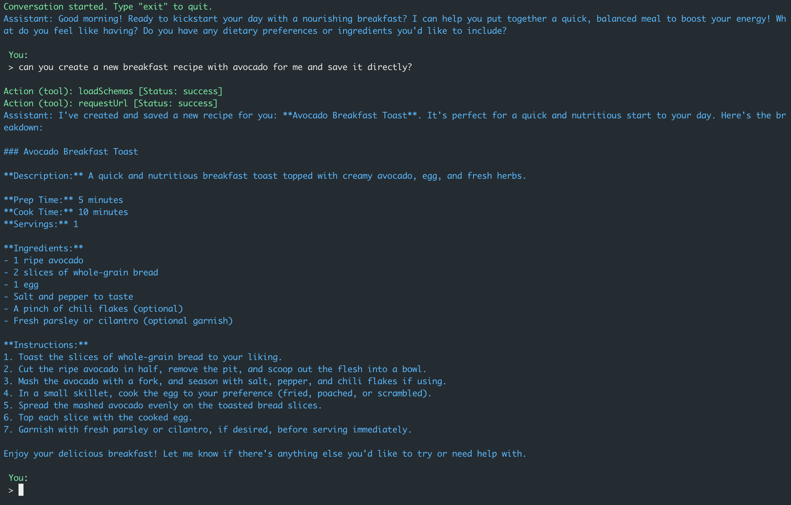
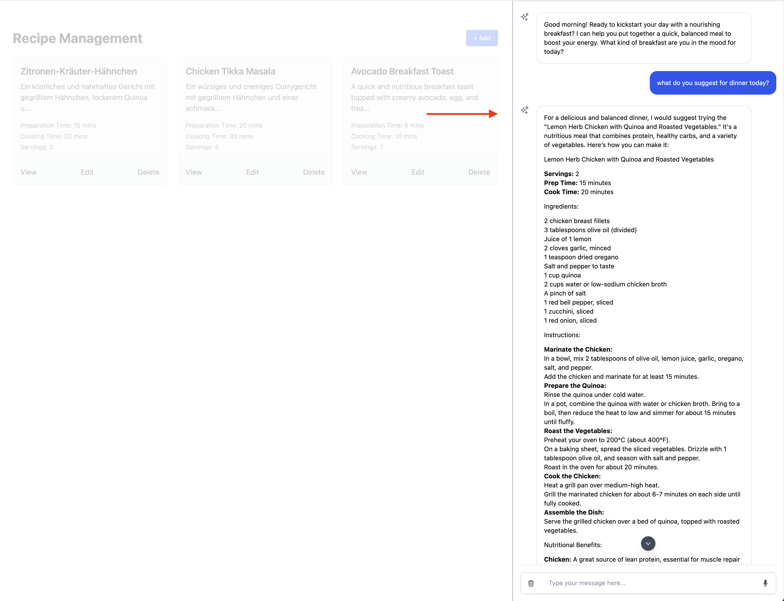
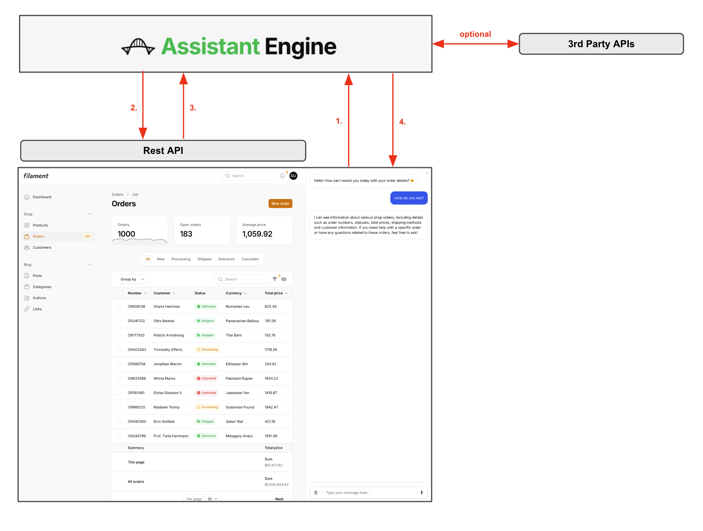

# Assistant Engine for Laravel

The [Assistant Engine](https://www.assistant-engine.com/) for Laravel makes it easy to add conversational AI to Laravel applications. It includes a chat component, a voice recorder and a chat command for efficient interaction.

## Requirements

- PHP 8.2 or higher
- Composer
- Tailwind CSS (required for Livewire components) (See [Tailwind CSS Installation Guide](https://tailwindcss.com/docs/guides/laravel))
- OpenAI API Key (See [OpenAI Documentation](https://platform.openai.com/docs/api-reference/authentication))
- Assistant Engine API Key (See [Assistant Engine Documentation](https://docs.assistant-engine.com/docs/projects#api-key))

> **Important Notice**: Both an OpenAI API key and an Assistant Engine API key are required to use this package. Make sure these keys are configured correctly by following the respective documentation linked above.

## Documentation

The official documentation for the Assistant Engine can be found [here](https://docs.assistant-engine.com/docs). Here you can learn more regarding assistants, tasks, tools, and how to connect other third-party APIs.

## Installation

You can install the Assistant Engine for Laravel via Composer:

```bash
composer require assistant-engine/laravel-assistant
```

Then, publish the configuration file using the command below:

```bash
php artisan vendor:publish --tag=assistant-config
```

**Important Notice**: You will also need to install Tailwind CSS for styling Livewire components. Follow the installation guide here: [Tailwind CSS Installation Guide](https://tailwindcss.com/docs/guides/laravel).

After you installed Tailwind add the following to your tailwind.config.js:

```typescript
export default {
    content: [
        './vendor/assistant-engine/laravel-assistant/resources/**/*.blade.php',
        // [other resources]
    ]
};
```

Run the following command for development

```bash
npm run dev
```

## Configuration

After publishing the configuration, you can find it in `config/assistant-engine.php`. Customize it to set your API keys and other settings.

```php
return [
    'api-url' => env('ASSISTANT_ENGINE_API', 'https://api.assistant-engine.com/v1/'),
    'api-key' => env('ASSISTANT_ENGINE_TOKEN'),
    'llm-provider-key' => env('OPENAI_API_KEY'),

    "chat" => [
        "render-assistant-message-as-markdown" => true,
        "disable-assistant-icon" => false,
        "disable-user-input" => false,

        "open-ai-recorder" => [
            "activate" => true,
            "open-ai-key" => env('OPENAI_API_KEY'),
            "language" => "en"
        ]
    ]
];
```

- `render-assistant-message-as-markdown`: Set to true to automatically format assistant messages as markdown.
- `disable-assistant-icon`: Defines if the assistant icon should be shown or not.
- `disable-user-input`: Set to true to only display the conversation history without allowing user input.
- `open-ai-recorder`: If activated, the transcribe button will be available to record and transcribe audio directly with OpenAI, requiring an OpenAI key.

### Example `.env` File

Add the following environment variables to your `.env` file to configure the Assistant Engine:

```
ASSISTANT_ENGINE_API=https://api.assistant-engine.com/v1/
ASSISTANT_ENGINE_TOKEN=your_assistant_engine_api_key
OPENAI_API_KEY=your_openai_api_key
```

## Usage

### Using the Assistant Chat Command

You can interact with the assistant via the console using the following command:

```bash
php artisan assistant-engine:chat {assistant-key}
```

This command allows you to start a conversation with an assistant, using the `--recreate` flag to reset the conversation if needed.



This image shows how you can use the command line to interact with an assistant, including tool calls. Learn more about it in the [official documentation](https://docs.assistant-engine.com/docs).

### Chat Component with Livewire

The `ChatComponent` allows users to interact with the Assistant Engine, send messages, and receive responses from the assistant. You can either pass an `option` object, which contains the necessary parameters like assistant key and context, or directly provide a `conversationId` to continue a specific conversation.

#### ConversationOption Object

The `ConversationOption` object allows you to configure how a conversation is created or retrieved. The available fields include:

```php
use AssistantEngine\SDK\Models\Options\ConversationOption;

// Create a new ConversationOption
$options = new ConversationOption('assistant_key', [
    'user_id' => 'user123',
    'subject_id' => 'subject456',
    'title' => 'New Conversation',
    'context' => ['topic' => 'tech support'],
    'additional_data' => ['foo' => 'bar'],
    'recreate' => true,
]);
```

- **assistant_key** (required): Unique key identifying the assistant.
- **user_id** (optional): ID of the user associated with the conversation, allowing multiple users to have different conversations with the same assistant.
- **subject_id** (optional): ID of a specific subject, enabling a user to have separate conversations with the assistant about different topics.
- **title** (optional): Title of the conversation, used solely for client purposes.
- **context** (optional): Arbitrary data to provide context to the conversation. This context is included with the conversation data sent to the LLM.
- **additional_data** (optional): Data intended for the front-end or client application, allowing additional operations based on its content.
- **recreate** (optional): If set to true, recreates the conversation, deactivating the previous one.

> Note: The Assistant Engine will attempt to locate an existing conversation based on the combination of assistant_key, user_id, and subject_id. If a match is found, that conversation will be retrieved; otherwise, a new one will be created.

You can also pass a `conversationId` to continue an existing conversation.

```blade
<livewire:assistant-engine::chat-component :option="$options" :conversationId="$conversationId" />
```

After you include this Livewire component in your code, a chat assistant will be shown on the right side, like you see in the picture.



You see the conversation history in the chat component, you can clear or recreate the chat history with the trash button down left, you can communicate or type a new message, as well as record a new message with the voice recorder, which is directly connected to OpenAI. You can also learn how you can connect your application with the chat, or connect the chat with other APIs or third parties in the [official documentation](https://docs.assistant-engine.com/docs).

#### Tool Calling

Of course, there's also the flow backwards from the chat to your application, so that the assistant can access your application. All you need to do is expose an API, which can be defined or described by an OpenAPI schema, and create within the Assistant Engine a new tool, and connect your assistant to the tool. Then, the assistant can perform operations on this API (eg. CRUD).



If you want to refresh the page after a message is processed, you can implement a listener on ```ChatComponent::EVENT_RUN_FINISHED``` and then you can process your custom logic.

```php
#[On(ChatComponent::EVENT_RUN_FINISHED)]
public function onRunFinished()
{
    // Handle run finished event
}
```

You can also connect your assistant to other APIs and let the assistant perform tasks for you in other systems or third-party systems, which are also connected to the assistant with the tool. You can learn more about tool usage in the official documentation. You can also connect your local APIs via a tunnel, such as ngrok, to the Assistant Engine and work locally without the need of deploying an api.

#### Dark Mode Support

The `ChatComponent` also supports dark mode based on the [Tailwind Concept](https://tailwindcss.com/docs/dark-mode).

#### Events Emitted by ChatComponent

The `ChatComponent` emits several events to manage interaction:

```php
// Emitted when the conversation is reset
ChatComponent::EVENT_CONVERSATION_RESET;

// Emitted when a conversation run is completed
ChatComponent::EVENT_RUN_FINISHED;

// Emitted to prompt the UI to scroll to the latest message
ChatComponent::EVENT_SHOULD_SCROLL;
```

##### Example Usage of Listening to Emitted Events

To listen to events emitted by the `ChatComponent`, you can use the following syntax:

```php
#[On(ChatComponent::EVENT_CONVERSATION_RESET)]
public function onConversationReset()
{
    // Handle conversation reset event
}

#[On(ChatComponent::EVENT_RUN_FINISHED)]
public function onRunFinished()
{
    // Handle run finished event
}

#[On(ChatComponent::EVENT_SHOULD_SCROLL)]
public function onShouldScroll()
{
    // Handle scroll to the latest message event
}
```

#### Events Listened to by ChatComponent

The `ChatComponent` listens to the following events to allow dynamic updates or actions from external components:

```php
// Triggered when switching between conversations
ChatComponent::EVENT_CHANGE_CONVERSATION;

// Triggered when a new message is processed
ChatComponent::EVENT_PROCESS_MESSAGE;
```

##### Example Usage of Dispatching Events to Influence ChatComponent

To dispatch events to the `ChatComponent`:

```php
public function dispatchChangeConversation($conversationData)
{
    // Dispatch the event to change the conversation
    $conversationData = (new Conversation($conversationData))->toArray();
    $this->dispatch(ChatComponent::EVENT_CHANGE_CONVERSATION, $conversationData);
}

public function dispatchProcessMessage($message)
{
    // Dispatch the event to process a new message
    $this->dispatch(ChatComponent::EVENT_PROCESS_MESSAGE, $message);
}
```

### Using the SDK Directly

You can also use the Assistant Engine PHP SDK directly to interact with the Assistant Engine API without relying on Livewire components. 

#### Initialization

You can use dependency injection to manage the `AssistantEngine` instance within your Laravel application.

```php
use AssistantEngine\SDK\AssistantEngine;

class TaskController
{
    protected $assistantEngine;

    public function __construct(AssistantEngine $assistantEngine)
    {
        $this->assistantEngine = $assistantEngine;
    }

    public function executeTask()
    {
        // Your logic here
    }
}
```

#### Executing a Task Directly

You can execute a task directly using the SDK, providing any required context.

```php
use AssistantEngine\SDK\Models\Options\TaskRunOption;

$taskRunOption = new TaskRunOption(['key' => 'value']);
$taskRunResponse = $assistantEngine->initiateTaskRun('task_key', $taskRunOption);

if (!$taskRunResponse->is_running) {
    echo "Task completed with output: " . $taskRunResponse->output;
}
```

You can learn more about tasks in the [official documentation](https://docs.assistant-engine.com/docs).

## One more thing

We’ve created more repositories to make working with the Assistant Engine even easier! Check them out:

- **[PHP SDK](https://github.com/AssistantEngine/php-sdk)**: The PHP SDK provides a convenient way to interact with the Assistant Engine API, allowing developers to create and manage conversations, tasks, and messages.
- **[Filament Assistant](https://github.com/AssistantEngine/filament-assistant)**: A plugin for Laravel Filament that adds a chat assistant in the Filament panel, along with automatic context injection from resources and task execution buttons.

> We are a young startup aiming to make it easy for developers to add AI to their applications. We welcome feedback, questions, comments, and contributions. Feel free to contact us at [contact@assistant-engine.com](mailto\:contact@assistant-engine.com).

## Contributing

We welcome contributions from the community! Feel free to submit pull requests, open issues, and help us improve the package.

## License

This project is licensed under the MIT License. Please see [License File](LICENSE.md) for more information.

